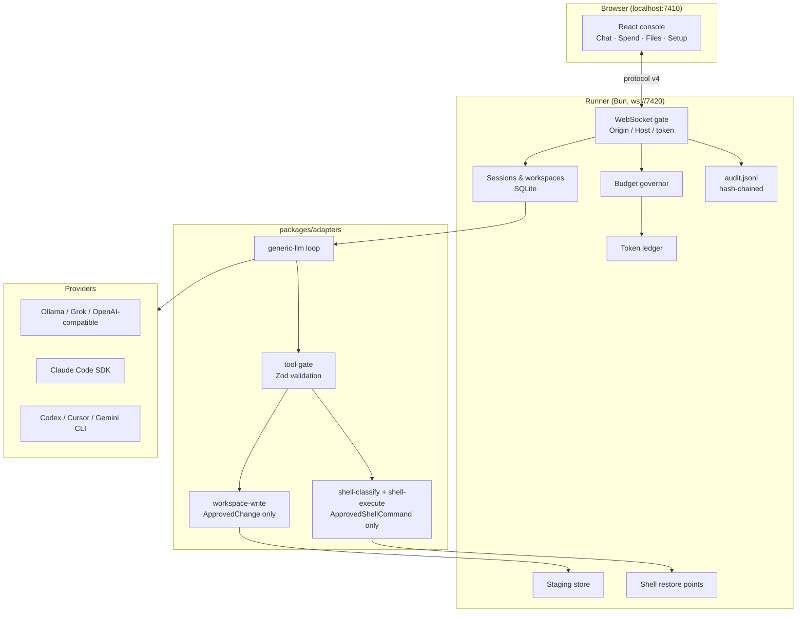

# Purser architecture

This document explains **what Purser is**, **how the pieces fit together**, and **why the safety model is shaped the way it is**. For protocol frames, repo file paths, and review checklists, see [REVIEW.md](REVIEW.md). For threats and controls, see [SECURITY.md](SECURITY.md).

---

## What we are building

**Purser is the control plane for coding agents on your machine.**

Coding agents (Claude Code, Ollama, Cursor CLI, Codex, Gemini CLI, Grok, Perplexity, …) do the work. Purser sits in front of them and answers three questions every serious team eventually asks:

1. **Who approved it?** — permission cards, bypass TTL, verifiable audit trail; workspace writes require an `ApprovedChange`.
2. **What actually changed?** — staged diffs, git worktrees, hash-chained audit log.
3. **How much did this cost?** — token ledger, budgets, run meter (this run / today / this month).

Agents run locally. The **runner and web console** do not phone home or send telemetry to Purser-operated services. Outbound network traffic happens only when you configure it: LLM provider API calls (keys in Settings), the hosted `web_search` tool (Perplexity when a key is set), optional voice (OpenAI STT/TTS), and shell commands such as `curl` when `run_bash` is enabled.

**One sentence:** Purser wraps coding agents with file edits you can approve, a record you can verify, and metering you can audit — through compile-time-enforced single paths, not hope.

---

## System overview



| Process | Port | Role |
| --- | --- | --- |
| Web console | `7410` | React UI — chat, diff cards, spend meter, Setup |
| Runner | `7420` | Single source of truth — DB, ledger, budgets, audit, filesystem |
| Relay (optional) | `7430` | Phone pairing; forwards frames, stores nothing |

The **runner** is the only process that touches disk, secrets, and the ledger. The browser never receives API keys.

---

## Repo layout

```
apps/web              React console (Vite + Tailwind)
apps/runner           Bun websocket server, ledger, budgets, staging, audit
apps/relay            Optional phone pairing relay
packages/protocol     Shared frames (protocol v4)
packages/adapters     Provider adapters, tool gate, write path, shell path
packages/db           SQLite (live); Drizzle pg-core table defs for future cells — no Postgres driver or migrations wired (`PURSER_DATABASE_URL=postgres://…` throws)
packages/pricing      Model catalog, tokenizers
packages/prompt-coach Pre-send token estimate (composer only)
packages/voice        STT/TTS integration
packages/integrations Pairing codes, relay seal
```

---

## The core design: one gate, one write path, one shell path

Most agent wrappers let the model call tools and rely on the UI to catch mistakes. Purser routes every dangerous operation through **narrow choke points**, enforced in TypeScript and tested at the source level.

### Five single enforcement points

Governance primitives. If you are scanning for where trust is enforced, start here.

| Primitive | Where it lives | What becomes impossible |
| --- | --- | --- |
| **Tool input validation** | `packages/adapters/src/tool-gate.ts` (`gateToolCall`) | Malformed JSON, unknown tools, or args that fail the Zod schema never reach execution |
| **Workspace writes, gated by `ApprovedChange`** | `packages/adapters/src/workspace-write.ts` (`commitToWorkspace`) | Any other call site writing workspace bytes — the type system requires an `ApprovedChange` only the approval step can mint |
| **Display labels** | `packages/protocol/src/display.ts` | Showing a dollar figure for subscription/local providers, or an approximate token count as exact |
| **Config resolution** | `packages/env/src/index.ts` (`resolvePurserEnv`) | Reading a `PURSER_*` variable outside the one typed resolver (README names are checked by test) |
| **Adapter response normalisation** | `packages/adapters/src/tool-call-normalize.ts` (`normalizeProviderResponse`) | A second door for tool calls — API `tool_calls` and content-embedded JSON share one path into the gate |

### What this gives you

Only rows we can point at in code and a passing test today:

| Capability | Status | Where |
| --- | --- | --- |
| Approval before any write | Enforced at compile time | `ApprovedChange`, `commitToWorkspace` |
| Shell command authorisation | Allowlist; unknown treated as mutating | Shell classifier |
| Rollback for mutating commands | Git restore point taken before execution | Shell gate / restore points |
| Provenance of a change | Session, workspace, file path, and approve/reject recorded | Audit log (`diff_response`) |
| Tamper evidence | Hash-chained, verifiable from the CLI | Audit log (`purser audit verify`) |
| Spend and quota limits | Checked before a run starts and as usage accumulates | Budget governor |

### What this does not protect against

These enforcement points do **not** make Purser a sandbox against a hostile same-user process, a compromised provider, or a prompt that tricks you into clicking Approve. In particular:

- A process running as the same OS user can still read `~/.purser/secrets.json` and the SQLite file.
- Loopback binding alone does not stop a malicious page from opening the websocket — Origin/Host allowlists do that work (see [SECURITY.md](SECURITY.md)).
- Bypass mode is god mode with a TTL; while it is on, tools run without cards.
- Native CLI adapters (Claude Code, Codex, …) still speak their own protocols; Purser meters and audits where hooked, but their internal tools are not rewritten through `gateToolCall`.

Do not read the table above as a claim that every agent action is impossible without Purser. The full threat model is in [SECURITY.md](SECURITY.md).

### Tool gate — validation

Every hosted tool call passes through `gateToolCall()` (`packages/adapters/src/tool-gate.ts`):

- Strict JSON parse; malformed args never reach execution.
- Zod schema per tool name.
- Unknown tools rejected before the adapter loop runs.

### File writes — approval token

File mutations never write disk directly from the model:

```
Model proposes write_file / apply_patch
  → StagedChange (ask mode) or immediate path (auto_edit)
  → DiffCard in UI
  → User approves
  → ApprovedChange (private constructor — cannot be minted elsewhere)
  → commitToWorkspace() — the only disk write function
```

`workspace-write.source.test.ts` scans the codebase and asserts **one write path**.

### Shell — classified, approved, single executor

`run_bash` is **disabled by default**. Opt in per workspace in Setup → Shell.

```
Model proposes run_bash (only if enabled for workspace)
  → Allowlist classifier (unknown = mutating, never safe)
  → Permission card names the effect, not raw JSON
  → ApprovedShellCommand (compile-time required on runGatedTool overload)
  → executeApprovedShell() — the only bash spawn site
  → Optional git restore point before mutating commands
  → "Undo last shell command" for the session (git repos only)
```

`shell-execute.source.test.ts` mirrors the write-path test: **one executor, one call site, behind the gate**.

#### Read-only allowlist

**Binaries:** `ls`, `cat`, `head`, `tail`, `wc`, `grep`, `rg` (no `--pre` / `--pre-glob`), `pwd`, `which`, `echo`, `env` (no arguments only)

**Git subcommands (positively identified):** `status`, `log`, `show` and `diff` (no `--output`), `branch` (bare or `--list` only)

**Find:** without `-delete`, `-exec`, `-execdir`, `-ok`, `-okdir`, `-fprintf`, `-fprint`, or `-fls`

Command chains split on `;`, `&&`, `||`, `|`, newline, and bare `&` (not `&&`).

Everything else is **mutating**. Subshells, redirects, backticks, `$()`, `${…}`, and `eval` are **unclassifiable → mutating**.

#### Card severities

| Severity | Meaning |
| --- | --- |
| Read-only | Ordinary permission card |
| Mutating | High-severity card; states what will change (e.g. "This changes git's index") |
| Network | Explicitly flags commands that contact the network (`curl`, `wget`, …) |
| Refused | Irreversible patterns (`rm -rf`, `git reset --hard`, `curl \| sh`, …) unless destructive shell is enabled in Setup |

Classifier rules: **allowlist only, never denylist.** See [SECURITY.md](SECURITY.md) § Shell.

---

## Permission modes

| Mode | File edits | Shell (when enabled) |
| --- | --- | --- |
| **ask** | Staged; Approve writes to your folder | Card for every command; mutating commands get restore point when possible |
| **auto_edit** | Applied immediately through gate | Classified and executed; mutating commands still snapshotted |
| **bypass** | Immediate; all tools logged `bypassed: true` | Same; requires explicit checkbox + TTL (30 min / 10 runs default) |

Bypass is **god mode with an expiry**, not a hidden default. A non-dismissible banner shows while it is active.

---

## Git worktrees

When you open a **git repository**, each session gets an isolated worktree under `~/.purser/worktrees/<session-id>/`, checked out at **HEAD**:

| | |
| --- | --- |
| What the agent sees | Committed files at HEAD — not uncommitted changes in the folder you opened |
| Non-git folders | Agent runs directly in your open folder |
| Approve a diff | Copies that file from the session worktree into your workspace |
| Reject | Discards the edit inside the worktree only |

Shell undo is separate: a session-scoped restore point captured **before mutating shell commands** (when the folder is a git repo and the tree is below a size cap).

---

## Metering and trust

| Layer | Guarantee |
| --- | --- |
| **Token ledger** | Append-only; provider + model coherence enforced; unpriced models stay `NULL` cost |
| **Budget governor** | Pre-run gate blocks over-cap runs; in-flight warn / ask / hard-stop |
| **Audit log** | Hash-chained `~/.purser/audit.jsonl`; `bun run purser -- audit verify` |
| **Display** | UI spend labels derived from ledger queries — not invented client-side |
| **Secrets** | API keys in `~/.purser/secrets.json` (mode `0600`); never SQLite |
| **Config** | Runner token in `~/.purser/config.json` (0600); never printed |

The run meter sits after status and pending-approval counts in the top bar. The prompt coach under the composer counts **this prompt only** before Send — not the agent loop. See [METERING.md](METERING.md).

---

## Adapter layer

Providers plug in through `packages/adapters`. Each adapter implements `run(input: RunInput)` and yields `AgentEvent` streams.

**Generic LLM path** (Ollama, Grok, OpenAI-compatible, Perplexity):

- `runToolLoop()` in `generic-llm/loop.ts` drives the turn loop.
- Tool definitions filtered by workspace settings (e.g. `run_bash` omitted when disabled).
- `normalizeProviderResponse()` unifies API `tool_calls` and content-embedded JSON.

**Native paths** (Claude Code SDK, Codex CLI, Cursor CLI, Gemini CLI) wrap vendor runtimes but still respect permission modes and audit hooks where applicable.

Hosted tools sent to generic LLM adapters: `read_file`, `write_file`, `apply_patch`, `list_dir`, `ripgrep_search`, `web_search`, and optionally `run_bash`.

---

## Protocol

Clients (web UI, future VS Code/Cursor extensions, phone via relay) speak **protocol v4** over WebSocket to the runner. All state changes flow as typed messages; see [REVIEW.md §6](REVIEW.md) for the full frame list.

Security at the transport layer:

- `Origin` and `Host` allowlists on loopback upgrade.
- Non-browser clients must present the runner token.
- Relay frames sealed with AES-GCM after pairing (pairing code via HKDF).

---

## Deploy modes

| Mode | Status | Storage | Scale |
| --- | --- | --- | --- |
| **Local companion** | Shipped | SQLite in `~/.purser` | One machine, one user |
| **Regional cells** | Specified, not shipped | Postgres + object store (schema defs only today) | One tenant per runner process; many cells |

The cloud never mounts your laptop disk. Hosted cells reuse the same protocol; the runner remains the filesystem boundary.

---

## Key files (quick reference)

| Concern | Location |
| --- | --- |
| WebSocket handler | `apps/runner/src/server.ts` |
| Run execution | `apps/runner/src/session-run.ts` |
| Staging | `apps/runner/src/staging.ts` |
| Shell restore | `apps/runner/src/shell-snapshot.ts` |
| Budget / ledger | `apps/runner/src/budget.ts`, `apps/runner/src/meter.ts` |
| Audit | `apps/runner/src/audit.ts` |
| Tool gate | `packages/adapters/src/tool-gate.ts` |
| Write path | `packages/adapters/src/workspace-write.ts` |
| Shell classifier | `packages/adapters/src/shell-classify.ts` |
| Shell executor | `packages/adapters/src/shell-execute.ts` |
| LLM loop | `packages/adapters/src/generic-llm/loop.ts` |
| Protocol types | `packages/protocol/src/` |

---

## Related docs

| Doc | Contents |
| --- | --- |
| [REVIEW.md](REVIEW.md) | Internal review surface — protocol tables, repo map, phase checklist |
| [SECURITY.md](SECURITY.md) | Threat model, shell controls, what we do not defend |
| [METERING.md](METERING.md) | Token observation, pricing rules |
| [COMPETITORS.md](COMPETITORS.md) | Honest feature matrix |
| [PLATFORM-RISK.md](PLATFORM-RISK.md) | Vendor terms |
| [RELEASING.md](RELEASING.md) | Binary compile, embed, release |
