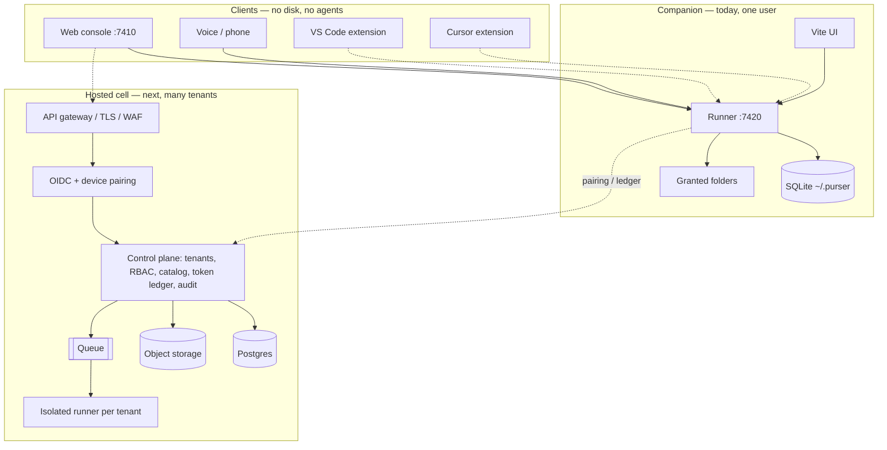
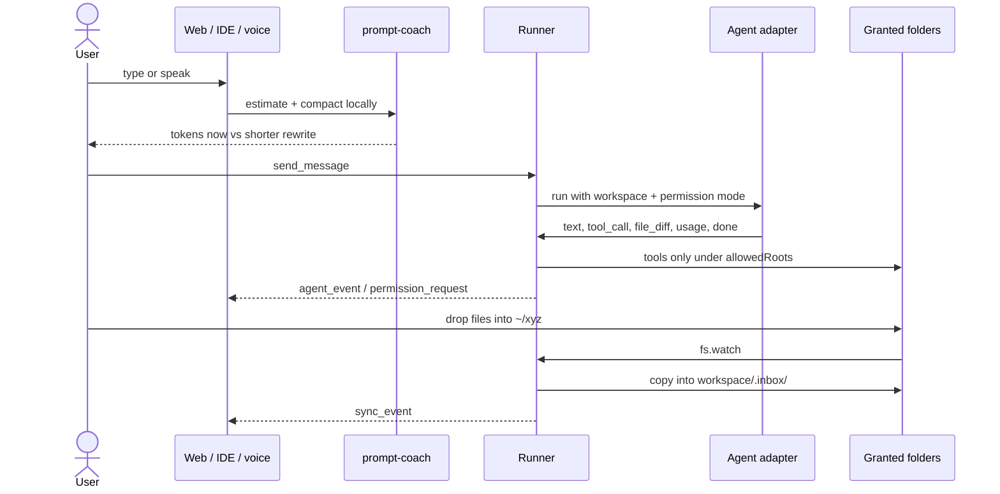

# Purser — product and architecture (review)

This is the internal review surface. The public homepage is [README.md](../README.md). Read this, then spot-check the packages listed at the end.

Purser is a **voice-first coding operations platform**. You talk to it, type to it, or drop files into a watched folder on your laptop. It runs **your** coding agents (Claude Code, Codex, Cursor CLI, Gemini CLI, Ollama, Grok, OpenAI-compatible, Perplexity, plus a fake Echo adapter) against a real project on disk. GitHub **and** GitLab are remotes. VS Code and Cursor are optional thin clients — they are not the product.

**Cursor and VS Code are editors with one (or more) assistants.** Purser is an **operator console** around agents you already pay for: granted folders, voice, a token ledger, budget caps before spend, drop-folder auto-sync, forge links, permission cards, a hash-chained audit log, and (later) multi-tenant cloud cells.

The wedge is **spend governance + auditability**. Multi-CLI orchestration, git worktrees, voice, and phone control are already common in 2026. See [COMPETITORS.md](COMPETITORS.md).

---

## 1. What you asked for vs what this is

| You asked | Product decision |
| --- | --- |
| Voice assistant | First-class: push-to-talk in the console, phone via a pairing relay, local voice commands (stop / approve / reject). |
| Cursor / VS Code–like workflow | Same loop: open a folder, chat, see tools, approve diffs. The console is dedicated, not a panel inside one vendor IDE. |
| VS Code + Cursor integration | Same websocket protocol as the web UI. Extensions must **not** spawn their own agents. Marketplace extensions are specified, not shipped. |
| GitHub **and** GitLab | `link_repository` sets `git remote origin`. Clone/push stay on your existing git login. |
| System folder access | You grant a folder. The **runner** is the only process that may touch disk, and only under `allowedRoots` (default `$HOME`). |
| Auto-sync from a drop folder (e.g. `~/xyz`) | Watch that folder. Files copy into the workspace `.inbox/`. Watcher refuses the workspace itself so copies cannot loop. |
| Token limits / shorten before send | Prompt coach: live `gpt-tokenizer` count of **this prompt** + a shorter rewrite that keeps code fences. The agent loop is the spend meter after Send. |
| Production architecture, deploy anywhere, thousands → millions of users | **Two deploy modes.** Today: one laptop companion (SQLite, loopback). Next: regional **cells** (Postgres, object store, isolated runners). Millions of users are many cells, not a bigger SQLite file. |

### What is already in the market (and what we are not)

As of 2026-08-25, a dozen tools already orchestrate several CLI agents, isolate git worktrees, and (in some cases) offer voice or a phone client. Claiming those as unique is false. The matrix is in [COMPETITORS.md](COMPETITORS.md).

Purser’s claimed gap is **append-only token ledger + budget governor + hash-chained companion audit**, with dollars only from official catalog rows. If a competitor ships that stack, this paragraph is wrong and must be updated.

---

## 2. Honest status (so you do not review fiction)

### Shipped (you can run this now)

- Local companion: web UI + runner websocket + optional relay
- Workspaces, sessions, runs, events, diffs with approve/reject
- Permission modes: `ask` / `auto_edit` / `bypass`
- Adapter registry (Echo always works with no key)
- Git worktrees per session when the folder is a git repo
- Voice start/stop, PCM chunks, optional STT/TTS
- Phone pairing through a relay that stores nothing and, after pair, forwards sealed frames
- Drop-folder watch → `.inbox/`
- Token coach in the composer (`gpt-tokenizer`; reports `tokenizer` vs last-resort `heuristic`)
- GitHub/GitLab origin link
- Clickable file tree + file preview
- Zod protocol, SQLite persistence, secrets in a 0600 file
- Websocket Origin/Host allowlists; non-browser upgrades require the runner token
- `/__purser/config` same-origin only in Vite development; production Vite and the runner return 404. Packaged HTML injects the token.
- `/health` returns `{ ok: true, protocolVersion: 4 }` only
- Pairing codes: Crockford ≥ 8 chars, TTL 120s, single use, rate limits
- Bypass TTL + run cap, non-dismissible banner, bypass tool calls in `audit.jsonl`
- Token ledger (`token_ledger`, append-only). Grok and Perplexity token rates from official pages (`asOf` 2026-08-25). OpenAI-compatible models stay **unpriced**. Override with `~/.purser/pricing.json`. See [METERING.md](METERING.md).
- Budget governor: `budgets` table, pre-run / in-flight gates, `spend_update`, warn / ask / hard stop. Protocol version **4**.
- Hash-chained `~/.purser/audit.jsonl` (0600). Verify with `bun run purser -- audit verify` from a clone, or `./dist/bin/purser audit verify` after compile. Rotation at 64 MB.
- Packaged companion: `bun run compile` embeds the UI. First run of the binary opens the browser and never prints the token. See [RELEASING.md](RELEASING.md).

### Specified, not implemented (review the contract, not a fake stack)

| Piece | Where to read | What exists |
| --- | --- | --- |
| VS Code / Cursor marketplace extensions | `extensions/vscode/README.md` | Protocol notes only. No `.vsix`. |
| Hosted HTTP control plane | `packages/integrations/src/control-plane.ts` | Types, scale gates, isolation rules, tenant hashing. No public API server. |
| Live Postgres | `packages/db/src/schema.postgres.ts` | Schema ready. `PURSER_DATABASE_URL=postgres://…` **throws** until a driver is wired. Companion uses SQLite. |
| Anthropic tokenizer package | `packages/pricing/src/tokenizer.ts` | `gpt-tokenizer` is shipped. `@anthropic-ai/tokenizer` is **not** installed; Claude prompts still use the OpenAI encoder. Heuristic `ceil(chars/4)` is last-resort if encode throws. |
| Public GitHub Release / Homebrew tap / signed binaries | `docs/RELEASING.md` | Compile script and CI workflow exist. No tagged public release. Formula sha256 values are zeros. Signing secrets are not in this repo. |
| Purser pricing | `PRICING.md` | **Human decision.** License is **Apache-2.0** (`LICENSE`). |

**Echo is a fake agent.** If the UI says “You said: …” and proposes `+# echoed` on `README.md`, you are testing the console, not a real model. Switch provider on the right to Claude / Codex / Cursor / Gemini / Grok / Ollama.

---

## 3. How to run the companion

Requires [Bun](https://bun.sh) ≥ 1.3.14.

```bash
bun install
bun run dev
```

| Process | Bind | URL |
| --- | --- | --- |
| Web console | `127.0.0.1:7410` | [http://127.0.0.1:7410](http://127.0.0.1:7410) |
| Runner | `127.0.0.1:7420` | `ws://127.0.0.1:7420` (loopback only) |
| Relay | `127.0.0.1:7430` | `ws://127.0.0.1:7430` |
| Phone UI | same Vite | [http://127.0.0.1:7410/phone](http://127.0.0.1:7410/phone) |
| Runner health | HTTP on 7420 | `http://127.0.0.1:7420/health` |

On first start the runner writes `~/.purser/config.json` (mode `0600`) with a random token, port `7420`, and `allowedRoots: [$HOME]`. The Vite dev server reads that file at `/__purser/config` so the browser can connect. The token is **never** printed to the terminal.

API keys (Grok, OpenAI, Perplexity, …) go in Settings and land in `~/.purser/secrets.json`. They never go in SQLite.

```bash
bun test
bun run typecheck
```

### Daily product loops to review on the laptop

**Folder auto-sync**

1. Create e.g. `~/xyz`.
2. Open a workspace.
3. Right panel (or Settings) → Watch this folder. `~/…` is expanded on the runner.
4. Drop a file into `~/xyz`. It appears as `workspace/.inbox/…`.
5. The watcher will not watch the workspace itself or `.inbox/` (loop break).

**Token coaching**

Type a padded prompt such as `please could you actually just check the code`. The composer shows **this prompt’s** token count (`gpt-tokenizer`) and **Use shorter prompt**. Code fences are kept. That number is not the agent loop and not the provider invoice — the run spend meter is.

**GitHub / GitLab**

Paste an `origin` URL on a folder that is already a git repo. Purser runs `git remote add|set-url origin`. Auth stays with your git credentials.

---

## 4. Architecture

Two modes share **one websocket protocol** (`packages/protocol`, version `4`). The cloud never mounts your laptop disk. The **runner** is the only process allowed to see filesystem paths.

### 4.1 Layers



### 4.2 Companion vs cell (hard split)

**Hard rule:** cloud APIs accept workspace ids and git remotes. They do **not** accept `/home/...` paths. Folder watch stays on the companion. Hosted cells ingest git and object-store uploads instead.

### 4.3 Prompt, tools, and drop-folder (what actually happens)



### 4.4 Scale path (production, not a bigger laptop)

| Gate | Users | Datastore | Compute | Isolation |
| --- | ---: | --- | --- | --- |
| Local companion | 1 | SQLite in `~/.purser` | One runner process | One machine, no multi-tenant sharing |
| Team cell | ~10k | Postgres + object storage | Kubernetes runners | **One tenant per runner process** |
| Regional cells | millions | Sharded Postgres, cell per region | Tenant-hashed routing (`routeTenant`) | Cells do not share runners or DBs |

`packages/integrations/src/control-plane.ts` defines `SCALE_GATES`, `ISOLATION_RULES`, `TokenLedgerEntry`, and `routeTenant(tenantId, region)` (FNV-1a → 16 cells per region). That is the deploy story: **many independent stacks**, not one global SQLite.

Isolation rules to sign off:

1. Hosted cells run one tenant per runner process. Do not multiplex orgs on one agent process.
2. Cloud APIs never take host filesystem paths.
3. Secrets: `0600` file locally, or KMS in a cell — never the session database.
4. Token ledger is append-only per tenant. Coaching happens **before** the run is billed.
5. Folder watch stays on the companion.

---

## 5. Repo map (where to look)

Monorepo: Turborepo + Bun workspaces, TypeScript strict.

```
apps/web                 operator console + /phone
apps/runner              websocket API, agents, watch, voice, git
apps/relay               pairing proxy — no store; post-pair frames are sealed
packages/protocol        zod wire contracts (protocol v4; no any)
packages/db              sqlite now, postgres schema ready
packages/adapters        echo / claude / cli / generic LLM / MCP
packages/voice           VAD + optional OpenAI STT/TTS
packages/prompt-coach    token estimate + compact rewrite (`gpt-tokenizer`; heuristic last-resort)
packages/pricing         official catalog + integer micro-USD + gpt-tokenizer
packages/integrations    GitHub/GitLab parse, origin/host guard, pairing, scale gates
extensions/vscode        IDE bridge contract (no extension code yet)
docs/SECURITY.md         companion threat model (Phase 0)
docs/METERING.md         what each adapter can observe and price
docs/RELEASING.md        compile, embed UI, codesign/Authenticode secrets, checksums
docs/COMPETITORS.md      honest matrix vs other orchestrators (asOf 2026-08-25)
docs/PLATFORM-RISK.md    vendor terms we actually opened, not guesses
docs/REVIEW.md           this file
LICENSE                  **Apache-2.0** (see repo root)
PRICING.md               Purser's own price **not decided** — human decision
Formula/purser.rb     Homebrew template (sha256 zeros until a real release)
install.sh               download + SHA256SUMS verify (needs PURSER_REPO)
```

| Concern | Primary files |
| --- | --- |
| Wire protocol | `packages/protocol/src/client-messages.ts`, `server-messages.ts` |
| Prompt coach | `packages/prompt-coach/src/index.ts` |
| Drop-folder copy | `apps/runner/src/folder-watch.ts` |
| Path sandbox | `apps/runner/src/paths.ts` |
| Git origin | `apps/runner/src/git.ts` (`setOriginRemote`) |
| Adapters | `apps/runner/src/registry.ts`, `packages/adapters` |
| Persistence | `packages/db/src/schema.sqlite.ts`, `queries.ts` |
| Token ledger / pricing | `apps/runner/src/meter.ts`, `packages/pricing`, `docs/METERING.md` |
| Budget governor | `apps/runner/src/budget.ts` |
| Secrets | `apps/runner/src/secrets.ts` |
| Audit (hash-chained JSONL) | `apps/runner/src/audit.ts` |
| Bypass TTL | `apps/runner/src/bypass.ts` |
| HTTP/WS origin guard | `packages/integrations/src/http-guard.ts` |
| Pairing + relay seal | `packages/integrations/src/pairing.ts`, `relay-seal.ts` |
| Vite token route | `apps/web/src/lib/dev-config.ts` |
| Bypass banner | `apps/web/src/components/BypassBanner.tsx` |
| UI composer / coach | `apps/web/src/components/ChatPane.tsx` |
| Inbox + git in UI | `apps/web/src/components/RightPanel.tsx` |
| Embedded UI / token inject | `apps/runner/src/ui-serve.ts` |
| Compile / release | `scripts/compile.ts`, `.github/workflows/release.yml` |
| Cell model | `packages/integrations/src/control-plane.ts` |

---

## 6. Protocol (clients and runner speak this)

Every frame: `{ id, type, payload }`. Zod `.strict()` — extra keys fail. Protocol version is `4` on `hello`. An older client gets a typed `protocol_version` error.

### Client → runner

| Type | Purpose |
| --- | --- |
| `hello` | Auth with runner token + protocol version |
| `get_state` | Full snapshot |
| `create_workspace` / `delete_workspace` | Grant / drop a folder |
| `browse_fs` / `read_file` | List and read under allowlist |
| `create_session` / `rename_session` / `delete_session` | Chat threads |
| `set_session_provider` | Provider, model, permission mode |
| `send_message` | User prompt → run |
| `cancel_run` | Abort |
| `permission_response` | Allow / deny a mutating tool |
| `diff_response` | Approve / reject a file patch |
| `list_models` / `check_provider_health` | Right panel; readiness is probed for every provider at startup |
| `voice_start` / `voice_audio_chunk` / `voice_stop` | Mic |
| `tts_speak` / `tts_stop` | Speech out |
| `upsert_provider_config` | Labels, base URL, API key (key stripped to secrets file) |
| `upsert_voice_profile` | STT/TTS persona |
| `pair_relay` | Phone |
| `estimate_prompt` | Server-side coach (deprecated; use `estimate_run`) |
| `estimate_run` | Coach + budget snapshot before send |
| `get_spend` / `set_budget` / `delete_budget` / `budget_response` | Spend report and budget HITL |
| `watch_folder` / `unwatch_folder` | Drop-folder sync (`~` allowed, expanded on runner) |
| `link_repository` | GitHub/GitLab origin URL |

### Runner → client

| Type | Purpose |
| --- | --- |
| `state` | Workspaces, sessions, events, runs, configs, voice, settings, **folderWatches**, **budgets**, **spendSummary**, protocolVersion |
| `spend_update` / `budget_request` / `budget_exceeded` / `spend_report` / `run_estimate` | Live spend and budget HITL |
| `workspace_created` / `session_created` | ACKs |
| `run_started` / `agent_event` / `run_finished` | Streaming run |
| `permission_request` | Human-in-the-loop |
| `models` / `provider_health` / `fs_listing` / `file_content` | Lookups. `provider_health` carries `state` and a `remedy` (title, fix, exact command) |
| `transcript_partial` / `transcript_final` / `tts_audio_chunk` | Voice |
| `relay_status` | Pairing |
| `prompt_estimate` | Coach payload |
| `sync_event` | Inbox copy added/updated/removed/error |
| `error` | Typed failure |

Agent events inside `agent_event`: `session_started`, `text_delta`, `text`, `thinking`, `tool_call`, `tool_result`, `file_diff`, `permission_request`, `usage`, `error`, `done`.

---

## 7. Data and secrets

**SQLite** (`~/.purser/purser.sqlite`, WAL): workspaces, sessions, events, runs, provider configs (no raw keys), voice profiles, settings, append-only `token_ledger`, `budgets`. Folder watches are stored under settings key `folder_watches` but **stripped out** of the generic `settings` array in `loadState` so the UI reads `folderWatches` only. Day/month spend buckets by **run start timestamp** (UTC).

**Postgres schema** exists for cells. It is not live.

**On disk (not SQLite)**

| Path | Role |
| --- | --- |
| `~/.purser/config.json` | Token, port, allowedRoots (`0600`) |
| `~/.purser/secrets.json` | Provider API keys |
| `~/.purser/pricing.json` | Optional catalog overrides (see [METERING.md](METERING.md)) |
| `~/.purser/audit.jsonl` | Hash-chained audit log (`0600`). Rotated files `audit-*.jsonl`. |
| `{workspace}/.inbox/` | Synced drop files |
| `{workspace}/.purser/worktrees/…` | Isolated git worktree per session when applicable |

**Workspace row** includes `absPath` (companion only) and `gitRemote`. Cloud cells must not persist laptop paths.

---

## 8. Compute: adapters, permissions, git

The runner looks up `providerId` in `apps/runner/src/registry.ts`.

| Id | Kind | Auth |
| --- | --- | --- |
| `echo` | Fake | none — always healthy |
| `claude_code` | SDK/CLI | `cli_login` |
| `codex` | CLI JSONL | `cli_login` |
| `cursor_agent` | CLI | `cli_login` |
| `gemini_cli` | CLI | `cli_login` |
| `ollama` | HTTP | none (local) |
| `grok` | HTTP | keychain |
| `generic_llm` | OpenAI-compatible | keychain |
| `perplexity` | HTTP | keychain |

Mutating tools require a permission card unless the session is `auto_edit` or `bypass` (bypass needs typing `bypass` plus a checkbox, then expires after 30 minutes or 10 runs). Diffs are approve/reject. Cancel aborts the active run.

If the workspace is a git repo, a session gets an **isolated worktree at HEAD** under `~/.purser/worktrees/` so parallel agents do not stomp the same checkout. The agent does not see uncommitted files in the folder you opened; **Approve** on a diff copies that file from the worktree into your open folder. Non-git folders run in place with no worktree.

---

## 9. Voice and phone

- Console: mic in the top bar and in the composer (PCM 16 kHz chunks).
- Profiles: wake word, STT/TTS provider, verbosity, interrupt-on-speech.
- Local commands parsed without a model: stop, cancel, repeat, approve, reject.
- Relay (`apps/relay`): Crockford pairing code, TTL/single-use/rate limits. Forwards frames; does not store them. After pair, phone and companion seal payloads (HKDF + AES-GCM). See [SECURITY.md](SECURITY.md).

---

## 10. Security (companion)

Full threat model: [SECURITY.md](SECURITY.md).

- Runner listens on **`127.0.0.1` only**, and still checks `Origin` / `Host` on upgrade.
- Paths must be absolute (or `~/…` which the runner expands). `..` is rejected. Symlinks that escape the workspace are rejected.
- `allowedRoots` defaults to `$HOME`.
- Secrets never in SQLite.
- Mutating tools ask unless auto-edit/bypass (bypass expires).
- Relay has no session store; it can still see ciphertext length after seal.
- Future cells: one tenant per runner; no shared agent process across orgs.
- Same-user local processes can read `~/.purser` — we do not claim otherwise.

---

## 11. UI map (what you see)

Three columns: workspaces/sessions · chat · provider/inbox/git/files.

- **Echo banner** when the fake adapter is selected.
- **Token coach** always under the composer (not only after you hunt in Settings).
- **Drop folder** and **Link origin** on the right panel.
- Colorized diffs, approve/reject.
- File tree: folders navigate, files preview.
- Top bar: connection, voice, last sync if a watch is active.

This is an **operator console**, not a full IDE. The editor remains VS Code or Cursor if you want one; Purser owns agents, disk grants, and spend.

---

## 12. Review checklist

Read in this order:

1. **This document** (`docs/REVIEW.md`) — product thesis, split companion vs cell, honest “not shipped” list.
2. [README.md](../README.md) — public, short.
3. [docs/SECURITY.md](SECURITY.md) — threat model and Phase 0 controls.
4. [docs/COMPETITORS.md](COMPETITORS.md) and [docs/PLATFORM-RISK.md](PLATFORM-RISK.md).
5. `packages/prompt-coach` — estimate + compact; tests in `src/index.test.ts`.
6. [docs/METERING.md](METERING.md) + `packages/pricing` — ledger honesty; unpriced stays `NULL`.
7. `apps/runner/src/folder-watch.ts` — copy contract, debounce, loop break; tests in `folder-watch.test.ts`.
8. `packages/integrations` — `parseRemote`, origin guard, pairing, `control-plane.ts`.
9. `packages/protocol` — client/server frames; `protocol.test.ts` must parse every type.
10. `apps/web/src/components/ChatPane.tsx` and `RightPanel.tsx` — coach, inbox, git, files, bypass banner, spend meter.
11. `apps/runner/src/ui-serve.ts` + [docs/RELEASING.md](RELEASING.md) — embedded UI and compile.
12. `extensions/vscode/README.md` — IDE must stay a client. Non-browser upgrades need `Authorization: Bearer`.
13. `LICENSE` is **Apache-2.0**. `PRICING.md` — Purser's own price not decided yet.

Sign-off questions:

- Do you accept that **Echo is for wiring**, not the demo of intelligence?
- Do you accept **gpt-tokenizer for every family** until `@anthropic-ai/tokenizer` is installed?
- Do you accept **folder watch on the laptop only**, never as a cloud `/home` path?
- Do you accept **cells** as the million-user story, not one SQLite?
- Do you accept the **spend ledger / budget / audit** wedge, given the 2026 orchestrator field?
- Which **Purser price** (if any)?
- Should marketplace VS Code/Cursor extensions be the next build, or hosted cells, or more adapters?

More product updates can land on this skeleton without rewriting the console.
